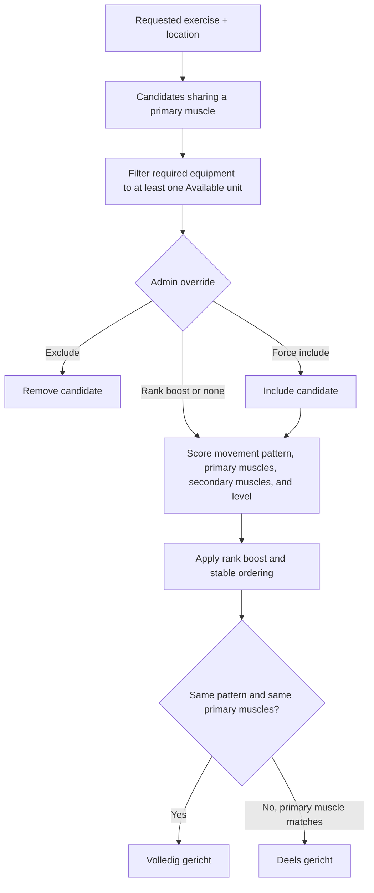

# Alternative selection flow

```mermaid
flowchart TD
  Start[Requested exercise + location] --> Primary[Candidates sharing a primary muscle]
  Primary --> Available[Filter required equipment to at least one Available unit]
  Available --> Overrides{Admin override}
  Overrides -->|Exclude| Removed[Remove candidate]
  Overrides -->|Force include| Included[Include candidate]
  Overrides -->|Rank boost or none| Score[Score movement pattern, primary muscles, secondary muscles, and level]
  Included --> Score
  Score --> Rank[Apply rank boost and stable ordering]
  Rank --> Label{Same pattern and same primary muscles?}
  Label -->|Yes| Full[Volledig gericht]
  Label -->|No, primary muscle matches| Partial[Deels gericht]
```
