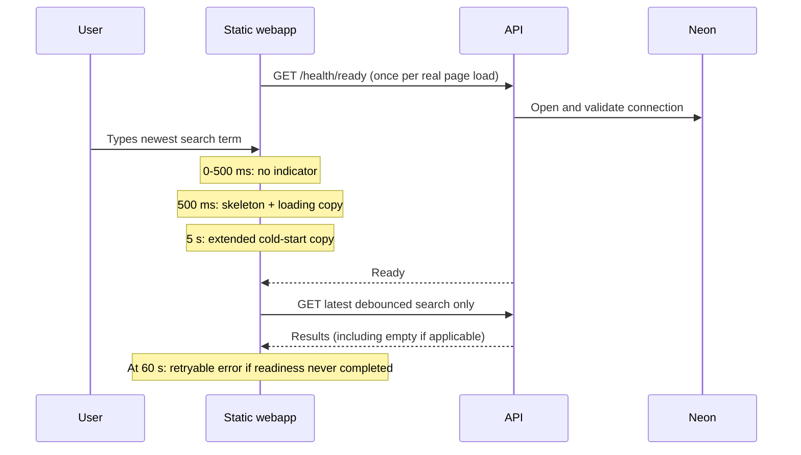

# Cold-start search sequence

```mermaid
sequenceDiagram
  participant U as User
  participant W as Static webapp
  participant A as API
  participant D as Neon

  W->>A: GET /health/ready (once per real page load)
  A->>D: Open and validate connection
  U->>W: Types newest search term
  Note over W: 0-500 ms: no indicator
  Note over W: 500 ms: skeleton + loading copy
  Note over W: 5 s: extended cold-start copy
  A-->>W: Ready
  W->>A: GET latest debounced search only
  A-->>W: Results (including empty if applicable)
  Note over W: At 60 s: retryable error if readiness never completed
```
