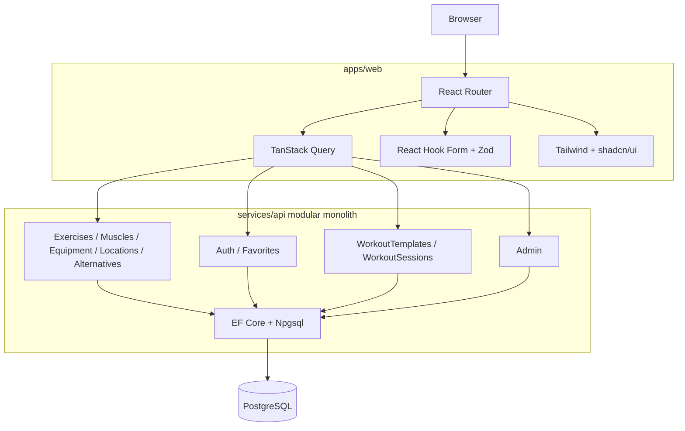

# Container and module view

```mermaid
flowchart TB
  Browser[Browser]

  subgraph Web[apps/web]
    Router[React Router]
    Query[TanStack Query]
    Forms[React Hook Form + Zod]
    UI[Tailwind + shadcn/ui]
  end

  subgraph API[services/api modular monolith]
    Public[Exercises / Muscles / Equipment / Locations / Alternatives]
    Accounts[Auth / Favorites]
    Workouts[WorkoutTemplates / WorkoutSessions]
    AdminModule[Admin]
    Persistence[EF Core + Npgsql]
  end

  Browser --> Router
  Router --> Query
  Router --> Forms
  Router --> UI
  Query --> Public
  Query --> Accounts
  Query --> Workouts
  Query --> AdminModule
  Public --> Persistence
  Accounts --> Persistence
  Workouts --> Persistence
  AdminModule --> Persistence
  Persistence --> PostgreSQL[(PostgreSQL)]
```
