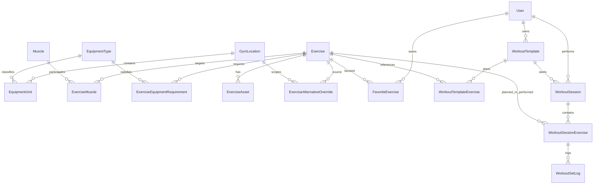

# Domain model

```mermaid
erDiagram
  GymLocation ||--o{ EquipmentUnit : contains
  EquipmentType ||--o{ EquipmentUnit : classifies
  Exercise ||--o{ ExerciseMuscle : targets
  Muscle ||--o{ ExerciseMuscle : participates
  Exercise ||--o{ ExerciseEquipmentRequirement : requires
  EquipmentType ||--o{ ExerciseEquipmentRequirement : satisfies
  Exercise ||--o{ ExerciseAsset : has
  Exercise ||--o{ ExerciseAlternativeOverride : source
  GymLocation ||--o{ ExerciseAlternativeOverride : scopes
  User ||--o{ FavoriteExercise : saves
  Exercise ||--o{ FavoriteExercise : favored
  User ||--o{ WorkoutTemplate : owns
  WorkoutTemplate ||--o{ WorkoutTemplateExercise : plans
  Exercise ||--o{ WorkoutTemplateExercise : references
  User ||--o{ WorkoutSession : performs
  WorkoutTemplate ||--o{ WorkoutSession : starts
  WorkoutSession ||--o{ WorkoutSessionExercise : contains
  Exercise ||--o{ WorkoutSessionExercise : planned_or_performed
  WorkoutSessionExercise ||--o{ WorkoutSetLog : logs
```

`WorkoutSessionExercise` stores both the planned exercise ID and the actually performed exercise ID. A session-only replacement changes only the latter.
