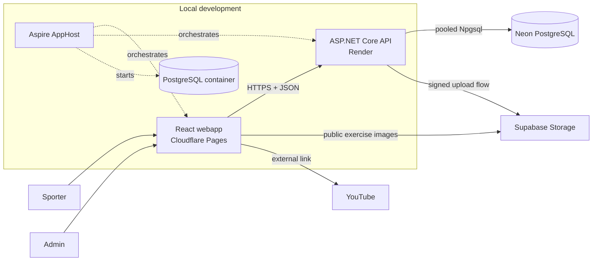

# System context

```mermaid
flowchart LR
  User[Sporter] --> Web[React webapp\nCloudflare Pages]
  Admin[Admin] --> Web
  Web -->|HTTPS + JSON| Api[ASP.NET Core API\nRender]
  Api -->|pooled Npgsql| Db[(Neon PostgreSQL)]
  Api -->|signed upload flow| Storage[Supabase Storage]
  Web -->|public exercise images| Storage
  Web -->|external link| YouTube[YouTube]

  subgraph Local development
    Aspire[Aspire AppHost] -. orchestrates .-> Web
    Aspire -. orchestrates .-> Api
    Aspire -. starts .-> LocalDb[(PostgreSQL container)]
  end
```

Aspire is intentionally absent from the production runtime.
