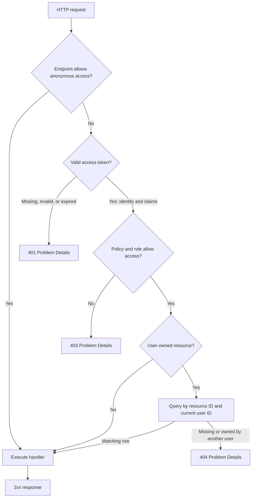
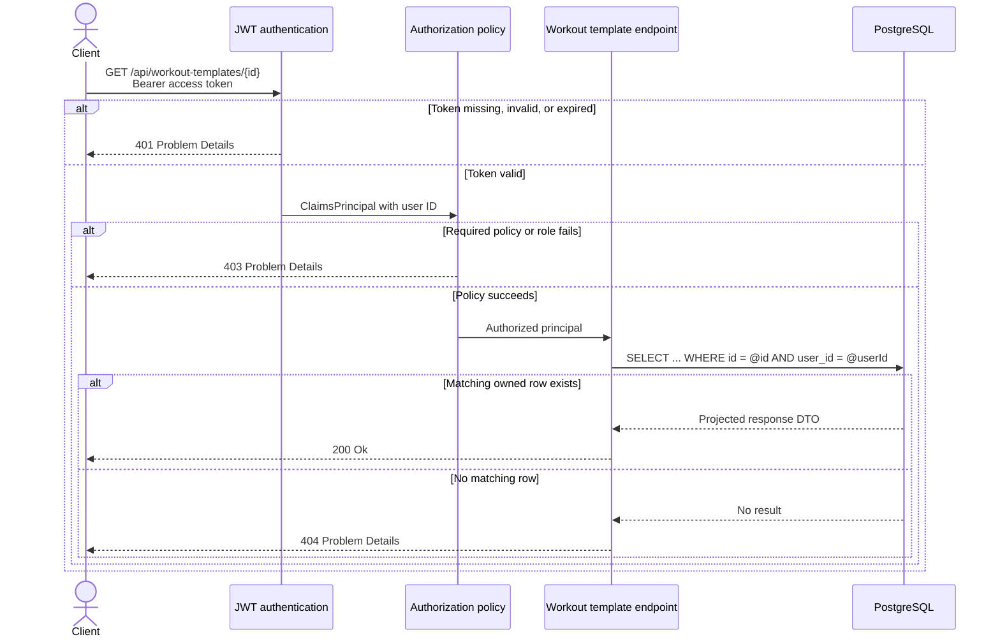

# Backend rules

## Goals

- Keep the request path easy to trace from HTTP contract through validation and authorization to
  the database operation.
- Prefer explicit feature code over framework-heavy indirection.
- Keep the API a feature-based modular monolith. Do not introduce MediatR, a command bus, generic
  repositories, or generic service layers without an accepted architecture decision.
- Use .NET Minimal APIs, FluentValidation, EF Core, PostgreSQL, ASP.NET Core Identity, and JWT
  bearer authentication.
- Keep UI copy Dutch and code, routes, database identifiers, Problem Details fields, and API
  contracts English.

## Vertical slices

- Organize API code by the feature areas listed in `services/api/Features/README.md`.
- A slice owns its endpoint mapping, request and response contracts, validation, handler logic,
  persistence queries, and focused tests.
- Keep a small use case in one clearly named file when that remains readable. Split it into a
  feature folder when it has distinct validation, calculation, persistence, or integration
  responsibilities.
- Keep business behavior with the feature that owns it. Move code to shared infrastructure only
  when multiple features need the same technical primitive.
- Extract a domain calculation when it is complex enough to test independently. Alternative
  scoring is one such calculation; a single EF Core query is not.
- Use EF Core directly in handlers. `DbContext` already provides repository and unit-of-work
  behavior.
- Keep `Program.cs` limited to composition, middleware, root route groups, and endpoint
  registration. Do not place feature business logic there.

## Routes and endpoint metadata

- Map application endpoints under one root `/api` group. Feature mappings must not add a second
  `/api` prefix.
- Use lowercase, plural, resource-oriented routes, for example `/api/exercises/{id}` and
  `/api/workout-sessions/{id}`.
- Use an action segment only when it represents a real domain transition that does not fit normal
  CRUD semantics, for example `/api/workout-sessions/{id}/complete`.
- Give every endpoint a stable `.WithName(...)` value and a feature-level `.WithTags(...)` value.
- Put authorization requirements in endpoint metadata. Mark genuinely public endpoints explicitly
  rather than relying on an accidental lack of authorization.
- Accept and pass a `CancellationToken` to every asynchronous EF Core or external I/O operation.
- Do not hard-code deployment hosts, frontend origins, or locally discovered service URLs.

## OpenAPI and Scalar

- Use `Microsoft.AspNetCore.OpenApi` as the generated API contract and Scalar as its interactive
  development UI. Do not maintain a second handwritten API specification.
- Register OpenAPI once with `builder.Services.AddOpenApi()`.
- Expose `/openapi/v1.json` and `/scalar` only in the Development environment. Keep both endpoints
  unavailable in production unless an accepted architecture decision defines the audience and
  access controls.
- Keep `.WithName(...)`, `.WithTags(...)`, typed results, `.ProducesProblem(...)`, and
  `.ProducesValidationProblem()` accurate because Scalar renders this endpoint metadata.
- When JWT authentication is implemented, add its bearer scheme and endpoint security requirements
  to the generated OpenAPI document. Never embed or preconfigure a real access token in Scalar.
- Test that both documentation endpoints are available in Development and return `404` in
  Production.

```csharp
// Program.cs
builder.Services.AddOpenApi();

var app = builder.Build();

if (app.Environment.IsDevelopment())
{
    app.MapOpenApi()
        .AllowAnonymous();

    app.MapScalarApiReference(options =>
        {
            options.WithTitle("GymAlternatief API");
        })
        .AllowAnonymous();
}
```

## Contracts and typed results

- Use immutable request and response DTOs, preferably `sealed record` types.
- Keep contracts with their slice. Promote a contract only when it is intentionally shared.
- Return DTO projections, never EF Core entities, Identity entities, or provider responses.
- Expose only stable public data. Never return password data, token hashes, storage keys,
  connection information, or provider-specific concurrency fields.
- Let the configured JSON serializer use `camelCase`; do not annotate every property merely to
  reproduce the default.
- Declare the exact result union on each handler and return `TypedResults`. Avoid `IResult`,
  `Results.Ok(...)`, and untyped anonymous success payloads in feature endpoints.

```csharp
private static async Task<Results<
    Ok<ExerciseResponse>,
    ProblemHttpResult>> HandleAsync(
    Guid id,
    AppDbContext db,
    CancellationToken cancellationToken)
{
    var response = await db.Exercises
        .AsNoTracking()
        .Where(exercise => exercise.Id == id)
        .Select(exercise => new ExerciseResponse(exercise.Id, exercise.Name))
        .SingleOrDefaultAsync(cancellationToken);

    if (response is null)
    {
        return TypedResults.Problem(
            statusCode: StatusCodes.Status404NotFound,
            title: "Exercise not found");
    }

    return TypedResults.Ok(response);
}
```

- A create endpoint returns `201 Created<T>` and a valid `Location` header.
- A successful read or update returns `200 Ok<T>`. A successful delete with no body returns
  `204 NoContent`.
- Do not wrap successful responses in a generic `{ success, data, message }` envelope.
- `ProblemHttpResult` does not encode a specific error status in its CLR type. Add
  `.ProducesProblem(statusCode)` for every expected Problem Details status so OpenAPI remains
  complete and verify the status in endpoint tests.
- If an endpoint has so many result branches that its typed union becomes hard to understand,
  simplify the use case or map a focused domain outcome to HTTP at the endpoint boundary. Do not
  silently fall back to an untyped result.

## Problem Details and status codes

- Return RFC 7807 Problem Details for every client-visible error. Use the shared exception handler
  for unexpected failures.
- Use a stable, non-secret `type` or extension error code when the frontend must distinguish error
  cases. Do not make the frontend parse human-readable `detail` text.
- Include a trace identifier through shared Problem Details customization so production errors can
  be correlated without exposing exception details.
- Never return stack traces, SQL, access tokens, internal identifiers, or provider error bodies.

| Situation | Result |
| --- | --- |
| Created resource | `201 Created<T>` |
| Successful read or update | `200 Ok<T>` |
| Successful delete | `204 NoContent` |
| Invalid request | `400 ValidationProblem` |
| Missing or invalid authentication | `401 ProblemDetails` through auth handling |
| Authenticated but not permitted | `403 ProblemDetails` through auth handling |
| Missing resource, including a foreign owned resource | `404 ProblemHttpResult` |
| Unique or optimistic-concurrency conflict | `409 ProblemHttpResult` |
| Unexpected failure | `500 ProblemDetails` through exception middleware |

- Do not catch every exception and convert it to `400`. Invalid input, domain conflicts, and
  unexpected failures are different conditions.

## Validation

- Validate every HTTP boundary: body, route, query, headers used by the feature, and uploaded file
  metadata.
- Use the core `FluentValidation` package for request DTO validation, including simple requests.
  Use `FluentValidation.DependencyInjectionExtensions` only for validator registration. Give every
  request with validation rules a focused `AbstractValidator<TRequest>` next to its slice.
- Register validators with dependency injection and invoke them through one shared asynchronous
  Minimal API endpoint filter. The filter must pass the request cancellation token to
  `ValidateAsync` and return `TypedResults.ValidationProblem(...)` when validation fails.
- Do not use the unsupported `FluentValidation.AspNetCore` automatic MVC integration or add a
  third-party auto-validation package. Do not invoke validators ad hoc inside individual handlers.
- Keep required values, length and collection limits, enum values, numeric ranges, allowed
  formats, and cross-field rules in the validator. Do not duplicate these rules with Data
  Annotations.
- Keep database-dependent decisions in the handler: existence, ownership, uniqueness, current
  equipment state, and whether a requested state transition is allowed.
- Do not perform EF Core queries from FluentValidation rules. This hides I/O, complicates tests,
  and is still subject to race conditions before the write.
- Mirror important validation in the database with required columns, maximum lengths, check
  constraints, foreign keys, and unique indexes. Application validation improves feedback; the
  database protects integrity.
- Normalize input only when the contract defines it. Trim user-entered text before validation or
  persistence consistently, but never silently rewrite identifiers or meaningful catalog values.
- Return `ValidationProblem` with errors keyed by the request field name. Keep field names and
  machine-readable codes stable and in English; the frontend owns Dutch presentation copy.
- Add `.ProducesValidationProblem()` to validated endpoints because an endpoint filter's result is
  outside the handler's declared typed result union.
- Put explicit upper bounds on page size, search length, collection size, and upload size before
  expensive work starts.
- Test boundary values and cross-field rules. Client-side validation never replaces API
  validation.

### Register validators once

Register all public validators in the API assembly once during composition. Keep this registration
out of individual feature handlers.

```csharp
// Program.cs
builder.Services.AddValidatorsFromAssemblyContaining<Program>(
    ServiceLifetime.Transient);
```

The assembly scanner only discovers public, non-abstract validators. A nested validator must
therefore be `public sealed`, not `private` or `internal`.

### Use one shared validation filter

The shared filter resolves the validator, locates the request contract, runs validation
asynchronously, and stops the endpoint before the handler when validation fails.

```csharp
public sealed class ValidationFilter<TRequest>(
    IValidator<TRequest> validator) : IEndpointFilter
    where TRequest : class
{
    public async ValueTask<object?> InvokeAsync(
        EndpointFilterInvocationContext context,
        EndpointFilterDelegate next)
    {
        var request = context.Arguments
            .OfType<TRequest>()
            .SingleOrDefault()
            ?? throw new InvalidOperationException(
                $"Endpoint has no {typeof(TRequest).Name} argument.");

        var result = await validator.ValidateAsync(
            request,
            context.HttpContext.RequestAborted);

        if (!result.IsValid)
        {
            return TypedResults.ValidationProblem(result.ToDictionary());
        }

        return await next(context);
    }
}
```

Expose one endpoint convention that adds both the filter and its OpenAPI response metadata. This
keeps the endpoint mapping explicit without repeating infrastructure details.

```csharp
public static class ValidationEndpointExtensions
{
    public static RouteHandlerBuilder ValidateRequest<TRequest>(
        this RouteHandlerBuilder builder)
        where TRequest : class
    {
        return builder
            .AddEndpointFilter<ValidationFilter<TRequest>>()
            .ProducesValidationProblem();
    }
}
```

### Attach validation explicitly to the endpoint

The validator stays next to the request. The endpoint activates it with exactly one
`.ValidateRequest<Request>()` call; the handler does not receive or invoke an `IValidator`.

```csharp
public static class CreateExercise
{
    public sealed record Request(
        string Name,
        Guid PrimaryMuscleId,
        ExerciseLevel Level);

    public sealed record Response(Guid Id, string Name);

    public sealed class Validator : AbstractValidator<Request>
    {
        public Validator()
        {
            RuleLevelCascadeMode = CascadeMode.Stop;

            RuleFor(request => request.Name)
                .NotEmpty()
                .MaximumLength(120);

            RuleFor(request => request.PrimaryMuscleId)
                .NotEmpty();

            RuleFor(request => request.Level)
                .IsInEnum();
        }
    }

    public static void MapEndpoint(IEndpointRouteBuilder app)
    {
        app.MapPost("/exercises", HandleAsync)
            .WithName("CreateExercise")
            .WithTags("Exercises")
            .RequireAuthorization(policy => policy.RequireRole("Admin"))
            .ValidateRequest<Request>()
            .ProducesProblem(StatusCodes.Status409Conflict);
    }

    // HandleAsync accepts Request, AppDbContext, and CancellationToken.
    // It contains database-dependent checks but no validation infrastructure.
}
```

The validation response is not part of the handler's `Results<...>` union because the endpoint
filter returns it before the handler runs. `.ProducesValidationProblem()` still advertises the
`400` contract in OpenAPI.

Do not use any of these endpoint shapes:

```csharp
// Wrong: registering a validator does not automatically execute it for a Minimal API endpoint.
app.MapPost("/exercises", HandleAsync);

// Wrong: validation infrastructure leaks into every handler and is easy to implement differently.
HandleAsync(Request request, IValidator<Request> validator, AppDbContext db);

// Wrong: the filter is present, but the validation response is missing from OpenAPI.
app.MapPost("/exercises", HandleAsync)
    .AddEndpointFilter<ValidationFilter<Request>>();
```

## Authentication, authorization, and ownership

Authentication establishes who sent the request. Authorization decides whether that identity may
use the endpoint. Ownership limits which rows that authorized identity may access. These are three
separate checks and must not be collapsed into one handler condition.



The ownership predicate belongs in the database query. Do not first load a row by ID and then
compare its owner in memory.



- Use ASP.NET Core Identity for account storage and JWT bearer access tokens for API
  authentication. Persistent user identifiers follow the repository-wide UUID rule.
- Use a fallback authorization policy or explicit `.RequireAuthorization()` so a new private
  endpoint cannot accidentally become public.
- Configure authentication and authorization failure handling to emit Problem Details for `401`
  and `403` responses rather than empty or framework-specific bodies.
- Require the explicit `Admin` role for every admin endpoint. Hiding admin UI is not authorization.
- Read the current user identifier from the authenticated principal. Never accept an owner or role
  from a request body, route, or query string.
- Include the current user identifier in the database predicate for every user-owned resource. A
  missing resource and a resource owned by another user both return `404` to avoid disclosure.
- Scope favorites, workout templates, and workout sessions to the current user in the query; do
  not load by ID first and check ownership afterward.
- Store only a cryptographic hash of each refresh token, rotate it on every successful refresh,
  revoke the previous token, and detect reuse according to the authentication design.
- If refresh tokens use cookies, set `HttpOnly`, `Secure`, and an intentional `SameSite` policy.
  Protect refresh and logout from cross-site requests by validating the allowed origin and the
  selected CSRF strategy.
- Keep authentication failures generic where more detail would enable account enumeration.
- Never log passwords, raw refresh or access tokens, authorization headers, or cookie values.

## EF Core and PostgreSQL

- PostgreSQL is the only relational database. Do not add provider-neutral workarounds that weaken
  PostgreSQL constraints or behavior.
- Use UUIDs for persistent identifiers and UTC for timestamps. Use `TimeProvider` when application
  code needs the current time so tests can control it.
- Use asynchronous EF Core APIs and propagate the request cancellation token.
- Use `AsNoTracking()` and project directly to response DTOs for read-only queries.
- Select only the columns and related data the response needs. Avoid lazy loading, unbounded
  `Include` graphs, N+1 queries, and loading a full table before filtering.
- Use `AnyAsync` for existence checks. Use `SingleOrDefaultAsync` when uniqueness is a database
  invariant; otherwise choose `FirstOrDefaultAsync` deliberately and apply a stable order.
- Paginate collection endpoints, cap the page size, and add a deterministic final ordering by ID
  or another unique column. Use a shared pagination contract consistently across features.
- Put entity configuration in focused `IEntityTypeConfiguration<T>` classes near the owning
  feature once inline `OnModelCreating` configuration becomes crowded.
- Configure required columns, lengths, precision, indexes, foreign keys, and delete behavior
  explicitly. Do not rely on conventions for important domain integrity.
- Inspect every cascade path. Deleting or deactivating catalog data must not erase workout history.
- Use database constraints as the final protection against duplicate favorites and other
  uniqueness rules. Map expected unique violations to `409`; do not use a pre-check as the only
  guard.
- Use optimistic concurrency for admin-managed catalog, equipment, and override records. With
  Npgsql, a `uint` property configured with `IsRowVersion()` maps to PostgreSQL's `xmin`; an
  explicit application-managed token is also valid. Do not copy SQL Server column assumptions.
- Expose concurrency to admin clients as an opaque token and require the token on an update. Map
  it back to the entity's original concurrency value and return `409` for a stale write.
- Keep one `SaveChangesAsync` call for a simple write. Use an explicit transaction only when a use
  case spans multiple saves that must commit atomically.
- Do not automatically retry state-changing requests unless the operation is idempotent or the
  client supplied a supported idempotency key.
- Treat `DbUpdateConcurrencyException` and known constraint violations explicitly. Let unexpected
  database failures reach exception middleware and logs.

## Migrations and catalog data

- The API must never apply migrations or seed production data during startup.
- Create migrations for schema changes and execute them through `services/migrations` before the
  corresponding API deployment.
- Keep schema changes backward-compatible with the currently deployed API whenever releases may
  overlap. Use expand-and-contract changes for destructive renames or type changes.
- Never edit a migration that has been applied to a shared environment. Correct it with a new
  migration; only regenerate an unapplied local migration deliberately.
- Exercise, muscle, equipment, location, and alternative data always come from the API and
  PostgreSQL. Do not add a static JSON fallback catalog.
- Make catalog imports repeatable and transactional, validate references before commit, and use
  stable identifiers or natural keys for idempotent upserts.

## Domain invariants

- An equipment type is usable at a location only when at least one corresponding equipment unit
  has status `Available`.
- Alternative scoring must be deterministic and independently testable. Apply admin exclusions,
  forced inclusion, and rank boosts explicitly, then use a stable tie-breaker.
- Preserve planned and performed exercises separately in workout sessions. A session-only
  substitution changes the performed exercise and never mutates the workout template or planned
  exercise.
- Historical workout data must remain interpretable if an exercise or equipment record is later
  renamed, hidden, or deactivated. Prefer deactivation over destructive deletion of referenced
  catalog records.
- Enforce invariants in the write path and, where possible, with database constraints. Do not rely
  on the frontend to preserve them.

## External I/O and reliability

- Keep external storage or provider code behind a small feature-oriented interface only when the
  feature actually needs it. Do not create speculative abstractions.
- Configure clients once through dependency injection and options validation. Do not construct a
  new provider client for every request.
- PostgreSQL and external storage do not share an atomic transaction. For a cross-system write,
  document the ordering and use compensation or an outbox as appropriate; do not pretend one EF
  transaction covers both systems.
- Set explicit timeouts and propagate cancellation to external calls. Apply retries only to safe,
  idempotent operations.
- Log the operation, feature, trace identifier, and safe resource identifiers. Never log secrets,
  signed URLs, tokens, or sensitive request bodies.

## Backend tests

- Follow `docs/rules/testing.md` and run the smallest relevant tests before the complete build.
- Unit-test validators, deterministic scoring, and isolated domain calculations.
- Integration-test endpoint contracts, authorization, ownership, EF Core mappings, constraints,
  pagination, concurrency, transactions, and Problem Details against real PostgreSQL with
  Testcontainers.
- Do not use EF Core's in-memory provider for behavior that depends on relational constraints,
  transactions, query translation, or PostgreSQL.
- For user-owned resources, create a second user and prove cross-user access returns `404`.
- Cover refresh-token rotation and reuse, admin-role enforcement, equipment availability,
  alternative overrides, and stable alternative ordering.
- Prove that a session-only substitution preserves both the template and planned exercise while
  recording the performed exercise.

## Avoid

- business logic in `Program.cs` or endpoint-registration methods;
- returning EF Core or Identity entities;
- untyped `IResult` handlers when the result set is known;
- ad-hoc error strings or inconsistent error envelopes;
- database calls inside validators;
- unscoped lookups for user-owned data;
- synchronous database or network I/O;
- lazy loading and hidden N+1 queries;
- generic repositories, generic services, MediatR, or command buses without an accepted decision;
- hard-coded secrets, origins, connection strings, storage credentials, or service URLs;
- `DateTime.Now` or local time for persisted timestamps;
- automatic migrations or production seeding during API startup;
- catching broad exceptions merely to return `400`;
- static JSON fallback data for the exercise catalog.
